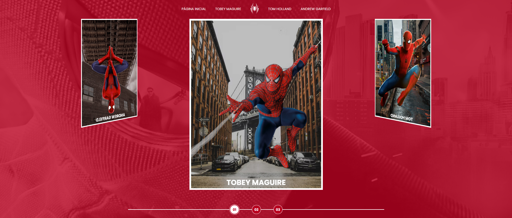

# Live Spider-Man Multiversos

# Multiverso Spider-Man: Criando um Site com HTML, CSS e JavaScript

## 📘 Sobre o Projeto

Este projeto é um desafio de aprendizado para desenvolvedores web iniciantes, focado em criar um site interativo que apresenta o universo do Homem-Aranha através dos filmes da franquia.

## ✨ Recursos

- Carrossel 3D com diferentes versões do Spider-Man
- Transições e efeitos visuais dinâmicos
- Design responsivo e moderno
- Galeria de imagens dos filmes

## 🛠️ Tecnologias Utilizadas

- HTML5
- CSS3 (com animações e transições)
- JavaScript (para interatividade)

## 🎯 Objetivos de Aprendizado

- Praticar layout e design responsivo
- Aprender técnicas de animação CSS
- Implementar interatividade com JavaScript
- Trabalhar com transformações 3D
- Criar efeitos de hover e transição

## 📸 Prévia

